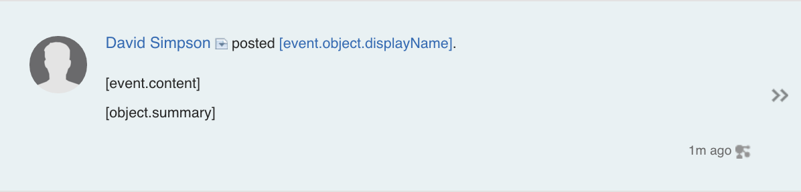
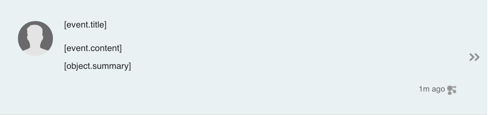
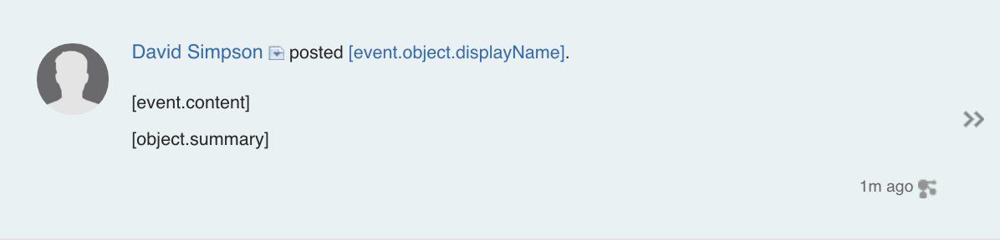
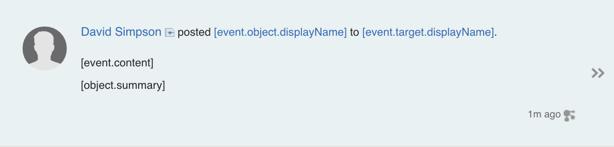
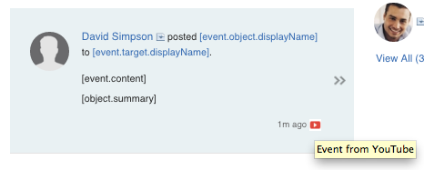
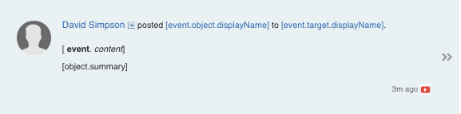
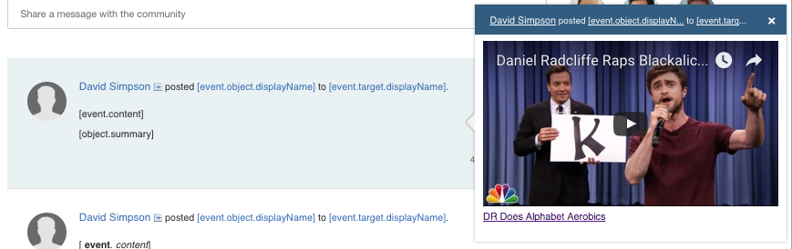
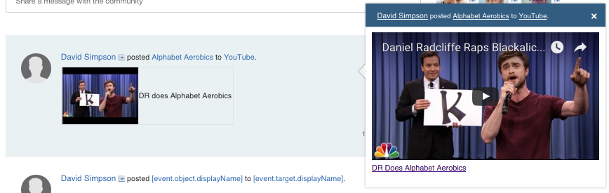

# IBM Connections Cloud Activity Streams

## Some initial setup

Rather than exposing user credentials in a presentation, we set them at the beginning and forget them.

We're posting to the activity stream for a community app, so set the UUID first too.

````

# for Basic Auth
export USERNAME=david@appfusions.com
export PASSWORD=******

# for OAuth2
export BEARER=****************************************************************************************************


# Your Community UUID
export COMMUNITY_UUID=bcca6081-d575-499f-829b-9a81550fa612

````


## Retrieving Activity Streams


### Get details of an activity stream

````
curl https://apps.collabservnext.com/connections/opensocial/basic/rest/activitystreams/urn:lsid:lconn.ibm.com:communities.community:$COMMUNITY_UUID/@all/@all \
     --user $USERNAME:$PASSWORD \
     -i -v --insecure
````


## Posting Activity Streams


### 1. Basic Activity

Using **Basic Auth:**

[activity-01.json](activity-01.json)

````
curl https://apps.collabservnext.com/connections/opensocial/basic/rest/activitystreams/urn:lsid:lconn.ibm.com:communities.community:$COMMUNITY_UUID/@all/@all \
     --user $USERNAME:$PASSWORD \
     -X POST -L -H "Content-type: application/json" \
     --data-binary @activity-01.json \
     -i -v --insecure
````

Using **OAuth2 Bearer Token**:

````
curl https://apps.collabservnext.com/connections/opensocial/oauth/rest/activitystreams/urn:lsid:lconn.ibm.com:communities.community:$COMMUNITY_UUID/@all/@all \
     -X POST -L \
     -H "Authorization:Bearer $BEARER" \
	 -H "Content-type: application/json" \
	 --data-binary @activity-01.json \
     -i -v --insecure
````

**Result:**



### 2. Basic Activity with title

[activity-02.json](activity-02.json)


````
curl https://apps.collabservnext.com/connections/opensocial/basic/rest/activitystreams/urn:lsid:lconn.ibm.com:communities.community:$COMMUNITY_UUID/@all/@all \
     --user $USERNAME:$PASSWORD \
     -X POST -L -H "Content-type: application/json" \
     --data-binary @activity-02.json \
     -i -v --insecure
````

**Result:**



### 3. Activity with templated title

[activity-03.json](activity-03.json)


````
curl https://apps.collabservnext.com/connections/opensocial/basic/rest/activitystreams/urn:lsid:lconn.ibm.com:communities.community:$COMMUNITY_UUID/@all/@all \
     --user $USERNAME:$PASSWORD \
     -X POST -L -H "Content-type: application/json" \
     --data-binary @activity-03.json \
     -i -v --insecure
````

**Result:**



Reference: [Templated Event Titles](http://www-10.lotus.com/ldd/appdevwiki.nsf/xpAPIViewer.xsp?lookupName=API+Reference#action=openDocument&res_title=Templated_event_titles_ic50&content=apicontent)

### 4. Activity with templated title & target

[activity-04.json](activity-04.json)


````
curl https://apps.collabservnext.com/connections/opensocial/basic/rest/activitystreams/urn:lsid:lconn.ibm.com:communities.community:$COMMUNITY_UUID/@all/@all \
     --user $USERNAME:$PASSWORD \
     -X POST -L -H "Content-type: application/json" \
     --data-binary @activity-04.json \
     -i -v --insecure
````


**Result:**



### 5. Activity with templated title & rollup (doesn't work)

[activity-05.json](activity-05.json)


````
curl https://apps.collabservnext.com/connections/opensocial/basic/rest/activitystreams/urn:lsid:lconn.ibm.com:communities.community:$COMMUNITY_UUID/@all/@all \
     --user $USERNAME:$PASSWORD \
     -X POST -L -H "Content-type: application/json" \
     --data-binary @activity-05.json \
     -i -v --insecure
````


**Result:**


### 6. Activity with generator

[activity-06.json](activity-06.json)


````
curl https://apps.collabservnext.com/connections/opensocial/basic/rest/activitystreams/urn:lsid:lconn.ibm.com:communities.community:$COMMUNITY_UUID/@all/@all \
     --user $USERNAME:$PASSWORD \
     -X POST -L -H "Content-type: application/json" \
     --data-binary @activity-06.json \
     -i -v --insecure
````


**Result:**




### 7. Activity with basic HTML content

[activity-07.json](activity-07.json)


````
curl https://apps.collabservnext.com/connections/opensocial/basic/rest/activitystreams/urn:lsid:lconn.ibm.com:communities.community:$COMMUNITY_UUID/@all/@all \
     --user $USERNAME:$PASSWORD \
     -X POST -L -H "Content-type: application/json" \
     --data-binary @activity-07.json \
     -i -v --insecure
````


**Result:**




### 8. Activity with opensocial/embedded experience

[activity-08.json](activity-08.json)


````
curl https://apps.collabservnext.com/connections/opensocial/basic/rest/activitystreams/urn:lsid:lconn.ibm.com:communities.community:$COMMUNITY_UUID/@all/@all \
     --user $USERNAME:$PASSWORD \
     -X POST -L -H "Content-type: application/json" \
     --data-binary @activity-08.json \
     -i -v --insecure
````


**Result:**




### 9. Putting it all together

[activity-09.json](activity-09.json)


````
curl https://apps.collabservnext.com/connections/opensocial/basic/rest/activitystreams/urn:lsid:lconn.ibm.com:communities.community:$COMMUNITY_UUID/@all/@all \
     --user $USERNAME:$PASSWORD \
     -X POST -L -H "Content-type: application/json" \
     --data-binary @activity-09.json \
     -i -v --insecure
````


**Result:**



HTML support is limited. All attributes are stripped. For layout, you have to resort to tables. Yikes!


